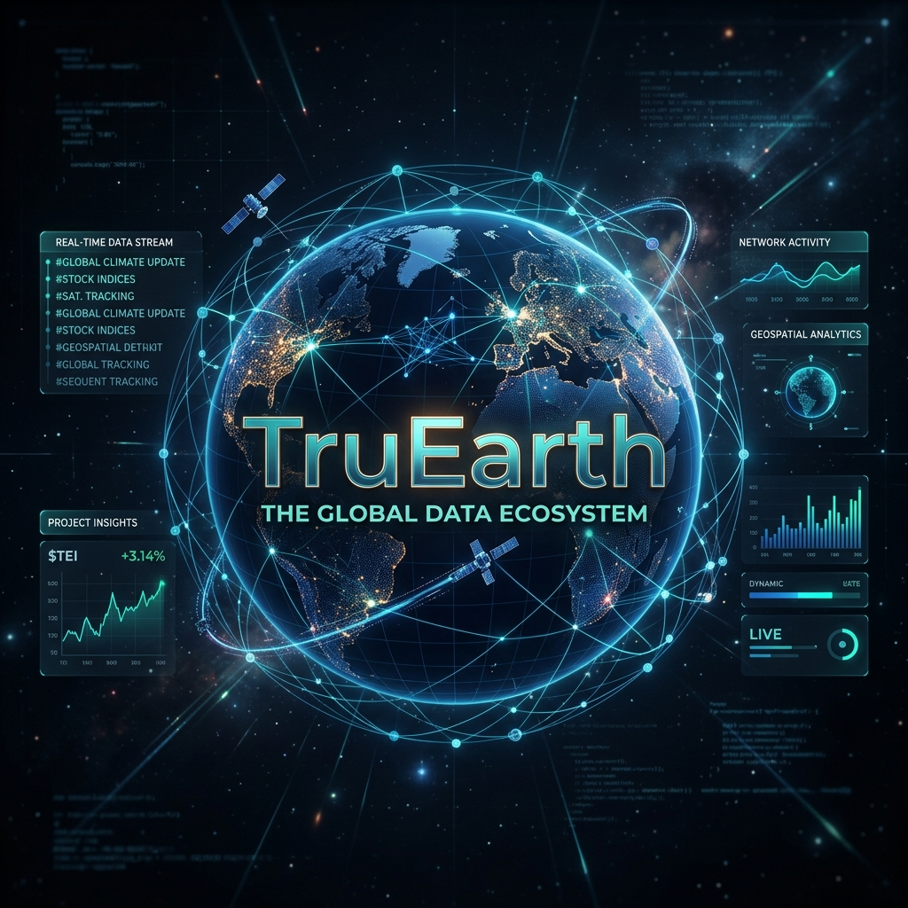

# 🌍 TruEarth: Real-Time Intelligence & Asset Tracking



> **TruEarth** is a high-fidelity, interactive intelligence platform designed for real-time monitoring of global assets, news verification, and geopolitical events. It combines 3D geospatial visualization with a robust data-processing engine.

---

## 🚀 Key Features

| Feature | Description |
| :--- | :--- |
| **🛰️ Global Asset Tracking** | Real-time monitoring of Satellites, Aircraft, and Ships with high-precision orbital and positional data. |
| **📰 Intelligence Engine** | Live RSS clustering from multiple global sources with automated legitimacy scoring and verification. |
| **🌐 Dual-Mode Visualization** | Seamlessly switch between a cinematic **3D Globe** and a high-performance **2D Flat Map**. |
| **📊 Market Integration** | Live financial tickers for Stocks, Crypto, and Commodities correlated with global events. |
| **⚡ Background Processing** | Offloaded high-frequency data handling using dedicated **Web Workers** for a lag-free UI. |

---

## 🛠️ Tech Stack

<div align="center">

| **Frontend** | **State & Logic** | **Performance** |
| :---: | :---: | :---: |
|  |  |  |
| Next.js 14+ (App Router) | Global State Management | Background Threading |
|  |  |  |
| UI Component Architecture | Type-Safe Intelligence Logic | High-Performance Styling |

</div>

---

## 📂 Project Structure

- `src/app/` - Next.js App Router routes and API endpoints.
- `src/components/` - Interactive UI components (Globe, Map, Panels).
- `src/lib/workers/` - Web Workers for satellite and vehicle data processing.
- `src/store/` - Zustand global state store.
- `src/types/` - Centralized TypeScript definitions for global entities.
- `public/data/` - Static datasets for cities, satellites, and assets.

---

## 🛠️ Getting Started

First, install dependencies and run the development server:

```bash
npm install
npm run dev
```

Open [http://localhost:3000](http://localhost:3000) to view the intelligence dashboard.

---

## 📜 License

© 2026 TruEarth Intelligence Platform. All rights reserved.
